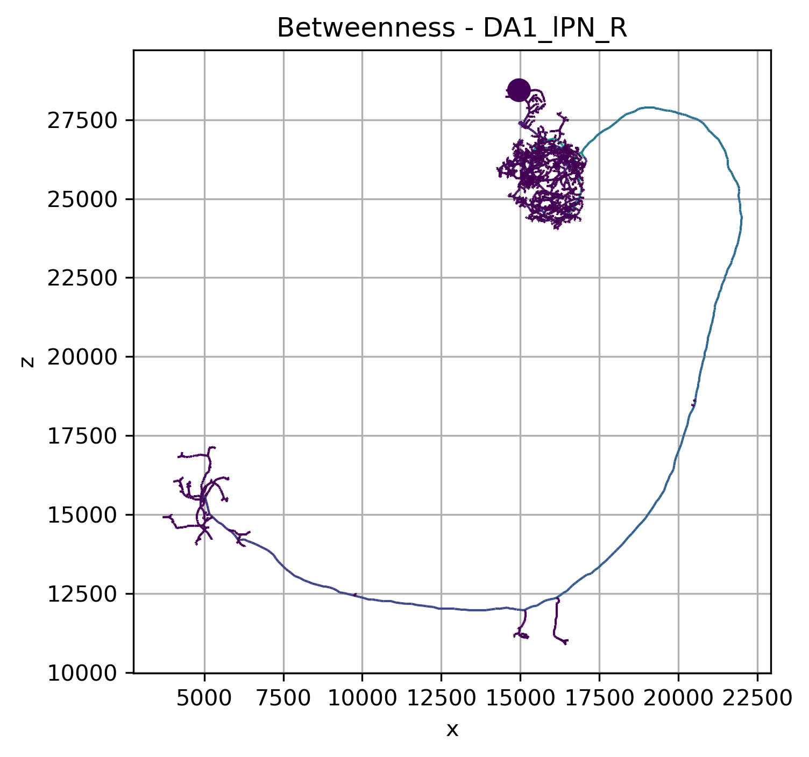
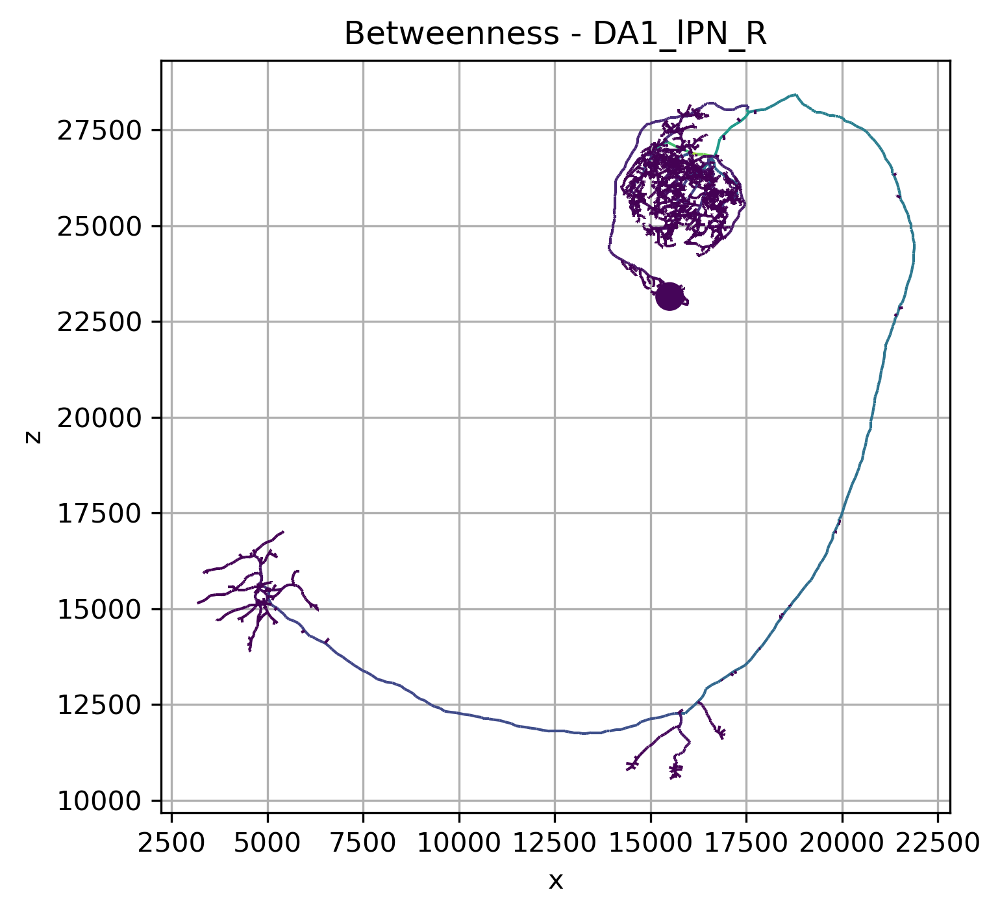
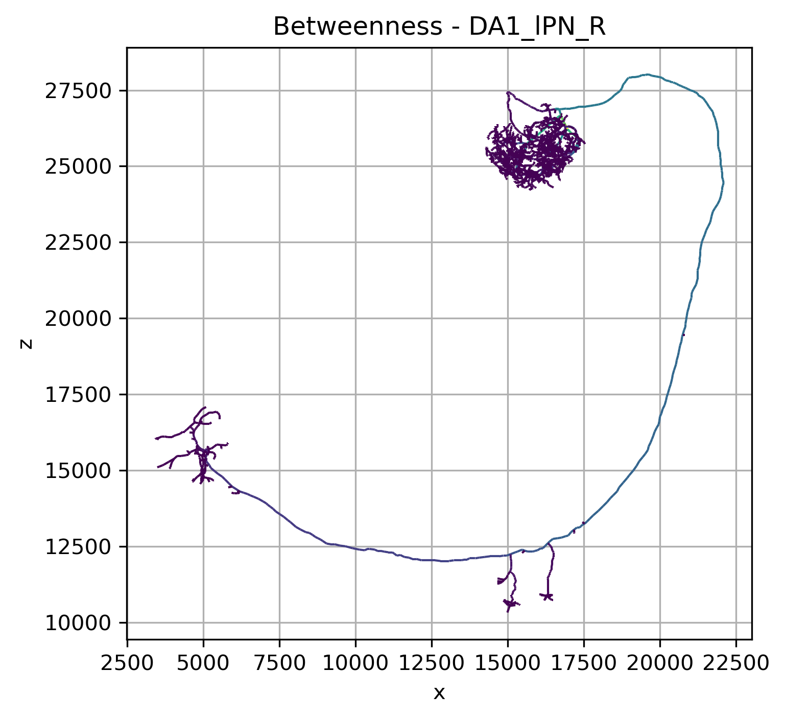

# Graph Analysis of Example Neurons

## Overview

Celem analizy jest opisanie morfologii szkieletowej neuronów za pomocą
podstawowych pojęć teorii grafów.

Przeanalizowano trzy przykładowe neurony typu:

`DA1_lPN_R`

udostępniane przez bibliotekę **NAVIS**.

W analizie neuron traktowany jest jako graf:

$$
G = (V,E)
$$

gdzie:

- $V$ — zbiór wierzchołków reprezentujących punkty rekonstrukcji,
- $E$ — zbiór krawędzi reprezentujących połączenia pomiędzy kolejnymi
  punktami szkieletu.

Do analizy topologicznej wykorzystano graf nieskierowany.

---

# 1. Model grafowy neuronu

Szkielet neuronu można interpretować jako drzewo:

```text
                        terminal node
                             ●
                            /
                           /
             branch ●─────●
                   /       \
                  /         \
                 ●           ● terminal node
                /
               /
root ●────────●


GitHub obsługuje w Markdown także prosty HTML. Zamiast trzech wielkich obrazów jeden pod drugim możesz zrobić:

```html
<table>
<tr>
<td align="center">
<br>
<b>1734350788</b>
</td>

<td align="center">
<br>
<b>1734350908</b>
</td>

<td align="center">
<br>
<b>722817260</b>
</td>
</tr>
</table>